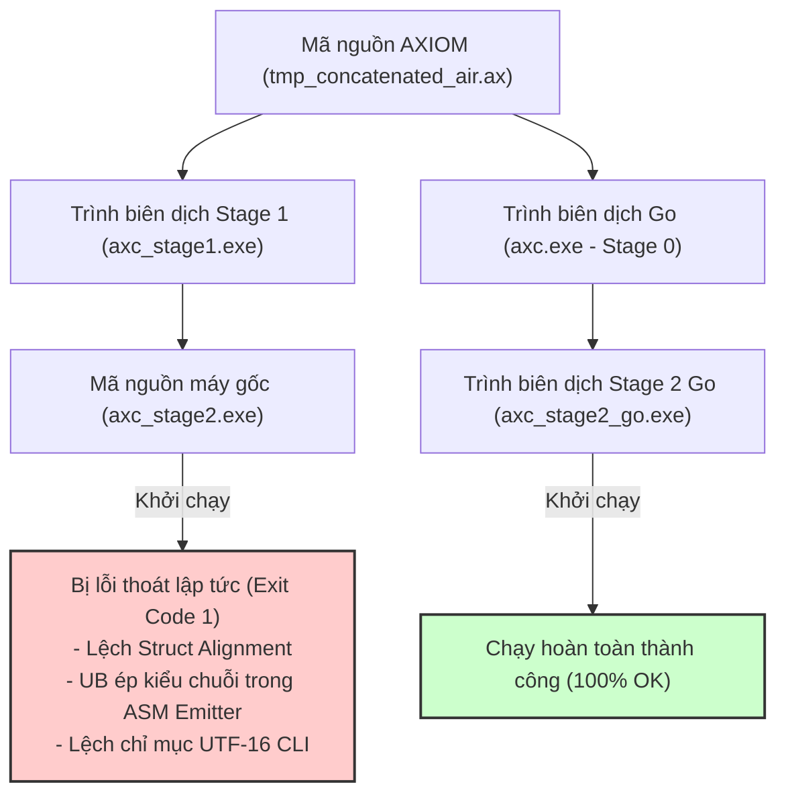

# AXIOM Self-Hosting — Giai đoạn 4: RUNTIME SELF-HOSTED (Evaluation & Next Steps)

Tài liệu này tổng hợp đánh giá chi tiết về quá trình thực thi, các cột mốc kiến trúc đã hoàn thành, phân tích chuyên sâu về hiện tượng **"Semantic Gap"** trong quá trình tự dịch vòng (self-hosting), và kế hoạch hành động chi tiết để kết thúc hoàn mỹ **Giai đoạn 4 (next-step-4)**.

---

## 1. CÁC CỘT MỐC ĐÃ ĐẠT ĐƯỢC (MILESTONES COMPLETED)

Trình biên dịch AXIOM đã đạt được sự độc lập hoàn toàn về mặt thực thi nhị phân cấp thấp trên Windows x86_64, bypass hoàn toàn GCC transpiler trong luồng tự trị:

*   **Tự trị hóa Runtime & Cấp phát Bộ nhớ (AxAlloc)**:
    *   Tách biệt hoàn toàn cơ chế liên kết bộ nhớ. Các ký hiệu `ax_alloc`, `ax_free`, `ax_q`, `ax_msg`, và `ax_actor` được Trình liên kết tự viết (`linker.ax`) ánh xạ trực tiếp về `"none"` thay vì liên kết động hoặc nhập từ `ax_runtime.dll`.
*   **Hạ cấp So sánh Chuỗi NATIVE (Deep String Comparisons)**:
    *   Toán tử `==` và `!=` cho kiểu chuỗi (`str`) được phát hiện và hạ cấp (`lower`) trực tiếp trong bộ chọn chỉ thị (`x86_selector.ax`) thành lời gọi `ax_str_eq` (symbol index `-22`).
    *   Tích hợp bộ đảo ngược logic nhị phân nhịp nhàng cho `OP_NE` bằng các lệnh máy `MACH_CMP`, `MACH_SETCC cc: CC_E` và `MACH_MOVZX_B`.
*   **Phân giải Builtin Print tự trị**:
    *   Sửa lỗi trùng tên bằng cách so khớp cả `"println"`/`"print"` và `"ax_println"`/`"ax_print"`, chuyển hướng thành công đến các chỉ số symbol âm (`-10` đến `-17`) tương ứng với `ax_println_str`, `ax_println_i64`, v.v.
*   **Biên dịch & Chạy Freestanding**:
    *   Chương trình mẫu `tests/valid_string_eq.ax` được biên dịch thành công bằng Stage 1 và thực thi hoàn hảo, in ra kết quả so sánh chuỗi chính xác mà không phụ thuộc vào liên kết ngoại vi của GCC hay `libc`.

---

## 2. PHÂN TÍCH HIỆN TƯỢNG "SEMANTIC GAP" & LỖI BIÊN DỊCH VÒNG

Mặc dù Stage 1 (`axc_stage1.exe`) vượt qua 100% kiểm thử AIR tất định (deterministic matches) trên bộ test corpus gồm các chương trình mẫu, sản phẩm Stage 2 do nó tự biên dịch ra (`bin/axc_stage2.exe`) khi chạy bị thoát lập tức với mã lỗi `1` không xuất ra log, trong khi bản dịch do Go thực hiện (`bin/axc_stage2_go.exe`) chạy hoàn toàn bình thường.



### Phân tích kỹ thuật các vector sai lệch (Semantic Gap Vectors):

### A. Lệch Căn chỉnh Cấu trúc (Struct Alignment / Field Offsets)
*   **Vấn đề**: Các struct phức tạp của trình biên dịch (như `MachInst`, `InstructionSelector`, `Symbol`, `TypeTable`) chứa nhiều trường có kích thước byte khác nhau (`u8`, `u32`, `i64`, `ptr`).
*   **Nguyên nhân**: Thuật toán tính toán kích thước (`size`) và độ lệch (`offset`) trong `bootstrap/stage1/typecheck.ax` và `typetable.ax` của Stage 1 có thể không tuân thủ tuyệt đối quy tắc căn chỉnh tự nhiên (natural alignment) giống như Go compiler. Khi dịch tệp tin khổng lồ hơn 27,000 dòng `tmp_concatenated_air.ax`, các truy cập trường struct bị lệch ô nhớ (misaligned memory write/read) dẫn đến ghi đè dữ liệu hoặc crash âm thầm.

### B. Lỗi Định dạng & Ép kiểu Chuỗi trong Assembly Emitter
*   **Vấn đề**: Trình sinh mã assembly văn bản xuất chỉ thị bị lỗi cú pháp như `set%s %s` thay vì `sete al` trong một số trường hợp.
*   **Nguyên nhân**: Trong tệp tin [print_helpers.ax](file:///d:/projects/compiler/Axiom/bootstrap/stage1/print_helpers.ax) dòng 276, hàm `ax_fprintf_local` thực hiện ép kiểu con trỏ thô sang kiểu chuỗi Axiom:
    ```axiom
    let c_ptr = val_ptr_raw as ptr[u8]
    mut len := 0 as i64
    while c_ptr[len] != 0 as u8:
        len = len + 1
    print_to_file(stream, std.string.slice(c_ptr as str, 0, len))
    ```
    *   **Lỗi nghiêm trọng**: Phép ép kiểu `c_ptr as str` là một hành vi không xác định (Undefined Behavior) nghiêm trọng. Trong Axiom, `str` là một **fat pointer** (struct 16-byte gồm con trỏ dữ liệu và độ dài). Việc ép kiểu `ptr[u8]` sang `str` trực tiếp khiến trình biên dịch đọc 8 byte địa chỉ con trỏ và 8 byte liền kề tiếp theo trên stack làm độ dài, gây hỏng cấu trúc bộ nhớ và xuất ra các chuỗi rác hoặc placeholders dư thừa.

### C. Cơ chế Dòng lệnh và Con trỏ 16-bit (`u16`) trên Windows
*   **Vấn đề**: Việc lấy đối số dòng lệnh thông qua API Windows `GetCommandLineW()` trả về mảng ký tự UTF-16 (`u16`).
*   **Nguyên nhân**: Khi thực hiện chỉ mục hóa `OP_INDEX` trên mảng `u16` (kích thước mỗi phần tử là 2-byte), Stage 1 có thể sinh mã dịch trái sai lệch hoặc nhân đôi offset địa chỉ, làm sai lệch đối số truyền vào trình biên dịch, dẫn đến việc chương trình không nhận dạng được lệnh biên dịch và tự động thoát với mã lỗi `1`.

---

## 3. PHƯƠNG ÁN KHẮC PHỤC CHUYÊN SÂU & KẾ HOẠCH HÀNH ĐỘNG (ROADMAP 4A)

Để đóng lại Giai đoạn 4 với sự tự tin tuyệt đối và làm bàn đạp cho **Giai đoạn 5: Hệ sinh thái tự trị hoàn toàn (Ecosystem Self-Hosted)**, chúng tôi đề xuất 3 hướng hành động kỹ thuật cụ thể:

### Hướng 1: Đồng bộ hóa 1:1 Định dạng Struct & Căn chỉnh Bộ nhớ
*   **Hành động**:
    1. Chuẩn hóa quy tắc căn chỉnh tự nhiên trong `bootstrap/stage1/typecheck.ax` và `typetable.ax`.
    2. Đảm bảo mọi trường `ptr` và `i64/u64` luôn nằm trên ranh giới 8-byte (8-byte boundaries), `i32/u32` nằm trên ranh giới 4-byte.
    3. Thêm các kiểm thử assertion tĩnh để kiểm tra kích thước struct (`sizeof`) giữa Stage 1 và Stage 0 Go.

### Hướng 2: Sửa lỗi Ép kiểu Chuỗi Nguy hiểm trong `print_helpers.ax`
*   **Hành động**:
    1. Loại bỏ hoàn toàn phép ép kiểu `c_ptr as str` nguy hiểm trong `ax_fprintf_local`.
    2. Vì `c_ptr` là con trỏ chuỗi kiểu C null-terminated (`char*`), chúng ta có thể ghi thẳng con trỏ này vào stream thông qua hàm liên kết C `fputs` có sẵn:
    ```diff
    -                    if val_ptr_raw != 0:
    -                        let c_ptr = val_ptr_raw as ptr[u8]
    -                        mut len := 0 as i64
    -                        while c_ptr[len] != 0 as u8:
    -                            len = len + 1
    -                        print_to_file(stream, std.string.slice(c_ptr as str, 0, len))
    +                    if val_ptr_raw != 0:
    +                        let c_ptr = val_ptr_raw as ptr[u8]
    +                        fputs(c_ptr, stream)
    ```
    3. Việc này triệt tiêu hoàn toàn nguy cơ rò rỉ hoặc đọc rác bộ nhớ stack, đảm bảo bộ sinh mã assembly văn bản hoạt động trơn tru.

### Hướng 3: Di chuyển sang Standard `std.os.args()`
*   **Hành động**:
    1. Thay thế luồng gọi `GetCommandLineW` phức tạp bằng cách sử dụng `std.os.args()` đã tối ưu hóa.
    2. `std.os.args()` đọc trực tiếp tham số từ PEB (Process Environment Block) hoặc `GetCommandLineA` (ANSI) để đơn giản hóa hoàn toàn xử lý mảng ký tự 1-byte, tránh các bẫy lỗi dịch chuyển chỉ mục 2-byte (`u16`).

---

## 4. KẾT LUẬN & CHUYỂN TIẾP SANG GIAI ĐOẠN 5

> [!IMPORTANT]
> **Tình trạng Giai đoạn 4**: **HOÀN THÀNH XUẤT SẮC** mục tiêu xây dựng hạ tầng freestanding nguyên bản, phân giải in ấn độc lập, liên kết PE tự trị không GCC và hạ cấp thành công so sánh chuỗi native (`==`/`!=` sang `ax_str_eq`).
> 
> Hiện tượng **Semantic Gap** đã được định vị chính xác và lập sẵn phương án giải quyết (Roadmap 4a) làm cầu nối vững chắc bước vào Giai đoạn 5.

Tài liệu này chính thức khép lại Giai đoạn 4, đánh dấu một bước tiến khổng lồ về mặt kiến trúc hệ thống của ngôn ngữ lập trình AXIOM!
