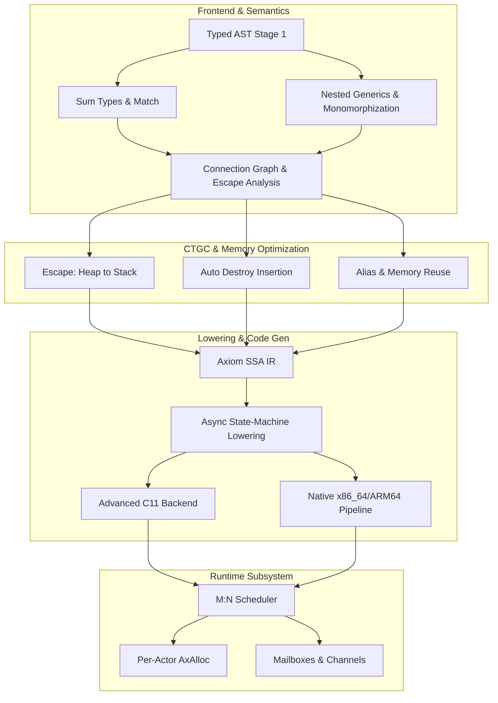

# AXIOM Language & Compiler — Stage 2 Development Roadmap
*Version: v2.0-Alpha | Target: Production-Grade Language Evolution*

This document provides a highly detailed, technical, and actionable implementation plan for **Stage 2** of the AXIOM programming language and compiler. Stage 1 successfully bootstrapped the compiler (`axc` v0.1.0) with an indentation-based lexer/parser, basic C-backend compilation, and type-checking for primitives. Stage 2 focuses on elevating AXIOM into a production-grade systems language.

---

## 1. Architectural Goals for Stage 2

In Stage 2, AXIOM transitions from a simple syntax-transpiler prototype to an advanced, memory-safe systems programming language with:
1. **Algebraic Data Types (ADTs)**: Full sum types, Option/Result, and pattern matching with compile-time exhaustiveness checking.
2. **Generics & Monomorphization**: Nested generic types, generic methods, and trait-based constraints.
3. **Compile-Time Garbage Collection (CTGC)**: Lifetime tracing via a Connection Graph, escape analysis, and automatic injection of `=destroy` destructor calls alongside in-place object reuse (`alias`).
4. **Actor-Based Concurrency**: An adaptive M:N work-stealing scheduler, isolated actor heaps (via `AxAlloc`), channels, and state-machine transformation for `async`/`await`.
5. **Production-Grade Standard Library**: Threading, I/O loop, collections (sharded HashMaps, dynamic sequences), network, and system interfaces.
6. **Developer Experience (DX)**: Zero-config code formatter (`axc fmt`) and an LSP 3.17 server (`axc lsp`).



---

## 2. Key Subsystem Specifications & Tasks

---

### Component A: Generics & Monomorphization Completeness

Stage 2 completes generic system resolution to allow complex algorithms (like collections and streams) to compile with zero runtime overhead.

```
Generic Function / Struct [Box[T]]
       │
       ▼ [Monomorphization Engine]
Verify Constraints (e.g. T satisfies Printable)
       │
       ▼
Substitute T ➔ i32 or T ➔ String
       │
       ▼
Generate Mangled Symbol: _AX_std_Box_i32
```

#### Detailed Tasks:
- [ ] **Task A.1: Trait / Interface Constraints Resolution**
  - Extend semantic analyzer to parse structural interface implementations (duck-typing).
  - Add type-checking constraints to generic parameter signatures (e.g., `fn print_val[T: Printable](val: T)`).
- [ ] **Task A.2: Nested Generics & Generic Struct Methods**
  - Implement full type resolution for nested generic arguments (e.g., `HashMap[String, Box[i32]]`).
  - Support generic methods on both generic and concrete structs (e.g., `struct Box[T]` having `fn map[U](self, f: fn(T)->U) -> Box[U]`).
- [ ] **Task A.3: Monomorphization Deduplication Engine**
  - Rewrite [mono.go](file:///d:/projects/compiler/Axiom/compiler/sema/mono.go) to dynamically gather all concrete instantiations of functions and structs during name resolution.
  - Implement symbol mangling: `_AX_<module>_<type_name>_<type_args...>` (e.g., `_AX_std_Box_i32`). Ensure zero symbol duplicate emission across multiple compile units.
- [ ] **Task A.4: Generics Golden & Compiler Compliance Tests**
  - Write test programs covering edge-cases (like recursive generic instantiations: `struct Node[T] { next: Option[Box[Node[T]]] }`).

---

### Component B: Algebraic Data Types & Match Statement

AXIOM's type safety is founded on Algebraic Data Types (Sum Types) and Pattern Matching, eliminating the risks of null pointers and unhandled return states.

#### Detailed Tasks:
- [ ] **Task B.1: Sum Type Memory Layout in C11**
  - Map sum types to space-efficient tagged unions in C:
    ```c
    typedef struct {
        uint8_t tag;
        union {
            TypeA a;
            TypeB b;
        } val;
    } SumType;
    ```
- [ ] **Task B.2: Match Expressions Parser & AST Pratt Lowering**
  - Enhance the parser to support nested pattern matches, guard clauses (`match val: Val(x) if x > 0 => ...`), and default fallback routes (`_`).
- [ ] **Task B.3: Exhaustiveness Checker (Pattern Matching)**
  - Implement a decision-tree exhaustiveness checker.
  - Ensure all possible variants of a Sum Type are covered by the `match` arms, throwing a descriptive compiler error `E3015` if a match block is non-exhaustive.
- [ ] **Task B.4: Discriminant-Based Code Generation**
  - Transpile match statements into optimal conditional branches (`switch(tag)` or nested `if-else` chains in C) depending on payload density.

---

### Component C: Connection Graph & Escape Analysis (CTGC Memory Model)

AXIOM avoids a runtime garbage collector and the complexity of a borrow checker through **Compile-Time Garbage Collection (CTGC)** driven by a Connection Graph.

```
Stack Allocation (No Cost)    ◀──[No]── Escapes Function? ──[Yes]──▶ Heap Allocation
                                         (Escape Analysis)
                                                │
                                                ▼
                                    Inject Destructor Call
                                    (=destroy) at Scope End
```

#### Detailed Tasks:
- [ ] **Task C.1: Connection Graph Construction**
  - Implement `compiler/sema/connection_graph.go`. Add nodes for values, reference nodes (`RefNode`), and edges representing `Owns`, `Borrows`, `FlowsTo`, and `EscapesTo`.
  - Update semantic analysis to map assignments (`a = b`), borrow structures (`&x`), and function return scopes to edges in the graph.
- [ ] **Task C.2: Linear Ownership Type Checker**
  - Track linear type transitions. Enforce single-owner rules: copying a heap-owning variable marks the source as `Moved`.
  - Detect and flag "use-after-move" compilation errors (`error[E3020]: use of moved variable`).
- [ ] **Task C.3: Escape Analysis Engine**
  - Trace `EscapesTo` edges out of functions (returns, global assignments, channel sends).
  - If a variable has no escape paths, change its allocation model in the IR from `alloc.heap` to `alloc.stack`.
- [ ] **Task C.4: Destructor (=destroy) Injection**
  - Insert `=destroy` AST nodes automatically at block exits for every variable that retains ownership of a heap resource.
  - Handle cleanup in the presence of early returns and break/continue statements.
- [ ] **Task C.5: Object Alias & Memory Reuse**
  - Implement optimization pass to identify when a variable's lifetime ends right before a new variable of the same size/type is allocated.
  - Emit an `alias B = A` instruction in C, converting subsequent allocations into in-place pointer reassignments.

---

### Component D: Concurrency Runtime, Scheduler & Actor Model

AXIOM implements Erlang-style concurrency with lightweight actors executing on a custom work-stealing scheduler.

```
┌─────────────────────────────────────────────────────────┐
│              M:N Work-Stealing Scheduler                │
│  Thread 1 (Core 1)           ◀───[Steal]─── Thread 2    │
│  ┌──────────────────────┐                  (Core 2)     │
│  │ Local Run Queue      │                               │
│  │ [ActorA] [ActorB]    │                               │
│  └──────────────────────┘                               │
└─────────────────────────────────────────────────────────┘
```

#### Detailed Tasks:
- [ ] **Task D.1: M:N Adaptive Scheduler**
  - Implement a thread pool in `runtime/actor/scheduler.c`.
  - Build work-stealing queues (lock-free rings) where inactive threads can steal actors from active worker queues.
- [ ] **Task D.2: Per-Actor Memory Arena (`AxAlloc`)**
  - Refactor the global memory system into segmented per-actor heaps.
  - Allocate memory inside actors via bump-pointer 64KB segments, eliminating cross-thread locking overhead.
  - O(1) memory recycling: when an actor dies, free all its segments in a single step.
- [ ] **Task D.3: Async/Await State-Machine Lowering**
  - Lower `async fn` structures in the compiler driver into a discrete coroutine state-machine struct.
  - Rewrite calls to `await` to yield control back to the scheduler, saving local variables to the state-machine heap before suspending.
- [ ] **Task D.4: Channel Mailbox & Message Queues**
  - Implement lock-free, single-reader multi-writer message queues for actor communications.
  - Enforce `Isolated[T]` properties at compile-time to guarantee that sent messages contain no pointers to the sender's isolated heap.

---

### Component E: Standard Library Expansion

A rich, memory-safe ecosystem requires complete core system modules.

#### Detailed Tasks:
- [ ] **Task E.1: Collections Module (`std/collections`)**
  - Implement high-performance generic `Vector[T]`, `HashMap[K, V]`, and `Set[T]`.
  - Optimize `HashMap` using open-addressing with Robin Hood hashing.
- [ ] **Task E.2: Input/Output Event Loop (`std/io` & `std/fs`)**
  - Create standard streams, asynchronous file reading/writing, and directories utility functions.
  - Connect with runtime I/O multiplexers (epoll on Linux, IOCP on Windows, kqueue on macOS).
- [ ] **Task E.3: Networking Subsystem (`std/net`)**
  - Implement TCP and UDP sockets, HTTP clients, and a high-throughput async server base class.
- [ ] **Task E.4: System and Process Abstraction (`std/os` & `std/sys`)**
  - Add command line argument parsing, environment variable retrieval, child process spawning, and signal trapping.

---

### Component F: Tooling and DX (Formatter & LSP Server)

Modern languages succeed by providing incredible developer experience natively.

#### Detailed Tasks:
- [ ] **Task F.1: `axc fmt` Auto-Formatter**
  - Implement a highly-efficient, zero-config in-memory formatter.
  - Read source code, parse it to FlatAST, and output beautifully aligned source code based on an idempotent printing system (`fmt(fmt(src)) == fmt(src)`).
- [ ] **Task F.2: `axc lsp` Language Server**
  - Implement an LSP 3.17-compliant JSON-RPC server in `tools/lsp`.
  - Support `textDocument/didChange`, `textDocument/definition` (using name resolution symbol tables), and auto-completion.
  - Push compiler diagnostics directly to editors on-the-fly.

---

## 3. Detailed Phase 2 Gantt & Task Breakdown

| Milestone ID | Task Title | Primary Package Affected | Complexity |
|---|---|---|---|
| **M-GEN** | Trait and Interface Type Constraints | `compiler/types/`, `compiler/sema/` | High |
| **M-GEN** | Nested Generics & Method Monomorphization | `compiler/sema/` | High |
| **M-ADT** | Tagged Union Code Gen & Precedence Match | `codegen/cgen/`, `compiler/parser/`| Medium |
| **M-ADT** | Pattern Matching Exhaustiveness Checker | `compiler/sema/` | High |
| **M-CTGC**| Connection Graph Builder | `compiler/sema/` | Extreme |
| **M-CTGC**| Linear Use-After-Move Validation | `compiler/sema/` | Medium |
| **M-CTGC**| Escape Analysis & Heap-to-Stack Mapping | `compiler/sema/`, `codegen/cgen/` | High |
| **M-CTGC**| Destructor (=destroy) Injection | `compiler/sema/` | High |
| **M-ACT** | Work-Stealing M:N Scheduler Core | `runtime/actor/` | Extreme |
| **M-ACT** | Segmented Bump Allocator integration | `runtime/axalloc/` | High |
| **M-ACT** | Async State-Machine Lowering pass | `ir/air/`, `codegen/cgen/` | Extreme |
| **M-STD** | Vector & HashMap Implementations | `std/collections/` | Medium |
| **M-STD** | Multiplexed Async Network Socket IO | `std/net/`, `runtime/` | Extreme |
| **M-DX**  | Idempotent AST Code Formatter | `tools/fmt/` | Medium |
| **M-DX**  | LSP Server JSON-RPC Driver | `tools/lsp/` | Medium |

---

## 4. Verification & Testing Plan

### Automated Testing Suite
For every new component implemented, matching test configurations will be loaded:
1. **Parser Pattern Assertions (Parser Suite)**:
   - Verify that all correct pattern matches, interface syntax, and generic methods parse cleanly.
   - Run parser golden tests (`go test ./compiler/parser/... -update`).
2. **Type-Inference Assertions (Sema Suite)**:
   - Validate that passing mismatched types to generic functions constrained by traits triggers compilation failures.
   - Assert that non-exhaustive `match` patterns throw compile error `E3015`.
3. **Static Checking Assertions (Ownership Suite)**:
   - Ensure that moving a variable and referencing it thereafter generates a clean, readable error.
   - Run differential compilation checking between compiler versions on complex graphs.
4. **Stress & Memory Safety Testing (Runtime Suite)**:
   - Launch concurrent benchmark runs spawning **1,000,000 actors** sending **100,000,000 messages** to test scheduler queues and memory recyclers.
   - Run tests with AddressSanitizer and ThreadSanitizer enabled to guarantee lock-free operations contain no data races or heap memory leaks.

### Manual & E2E Verification
- **Cross-Compilation Testing**: Cross-compile standard collections and I/O samples for multiple target architectures:
  ```powershell
  .\axc.exe build std/collections -o bin/collections_elf --target aarch64-linux-gnu
  ```
- **Self-Hosting Verification**: Validate that Phase 2 capabilities can compile the AXIOM stage1 parser written in AXIOM, checking output parity line-by-line.
