# AXIOM Language & Compiler — Stage 3 Development Roadmap
*Version: v3.0-Alpha | Target: Production Self-Hosting & Full Native Runtime*

This document provides a highly detailed, technical, and actionable implementation plan for **Stage 3** of the AXIOM programming language and compiler. Stage 2 successfully stabilized the core semantic checker, generics monomorphization, ADT pattern matching, and initial M:N scheduling. Stage 3 focuses on **fully self-hosting** both the compiler and its runtime, achieving 100% independence from host compilation environments and libc.

---

## 1. Architectural Goals for Stage 3

In Stage 3, AXIOM transitions from a bootstrapped compiler written in Go to a self-sufficient, production-grade language ecosystem characterized by:
1. **Self-Hosted Compiler**: The entire compiler front-end, type checker, semantic graph, IR lowering, and backend passes are rewritten in AXIOM (`bootstrap/stage1/compiler/*.ax`), compiling themselves with zero external dependencies.
2. **Native Runtime Porting**: Port the high-performance memory allocator (`AxAlloc`), work-stealing actor scheduler, and event loop reactor from C to AXIOM, achieving near-zero overhead and absolute safety.
3. **Hermetic & Independent Native Emitters**: Finalize the native machine code generator (`codegen/native`) and relocatable in-memory linker (`linker/`) to directly emit standard executables (ELF64, PE/COFF, Mach-O) for `x86_64`, `ARM64`, and `RISC-V`, bypassing GCC/Clang entirely for release builds.
4. **Reproducible Triple-Build Verification**: Implement strict deterministic compilation passes to guarantee bytecode-level reproducibility (`hash(Stage2(Stage1(src))) == hash(Stage3(Stage2(src)))`).

```mermaid
graph TD
    subgraph "Stage 3 Compilation Pipeline"
        Source[.ax Source Files] 
        --> Front[AXIOM-written Frontend] 
        --> AIR[SSA IR - AIR]
        --> NativeBackend[AXIOM Native Codegen]
        --> Linker[AXIOM Native Linker]
        --> Executable[Hermetic Native Binary]
    end

    subgraph "Self-Hosting Validation Loop"
        GoCompiler[Go axc Stage 0] -->|Compiles| AxiomSrc1[AXIOM Compiler Source]
        AxiomSrc1 -->|Produces| BinaryStage1[Stage 1 Binary]
        BinaryStage1 -->|Compiles| AxiomSrc2[AXIOM Compiler Source]
        AxiomSrc2 -->|Produces| BinaryStage2[Stage 2 Binary]
        BinaryStage2 -->|Compiles| AxiomSrc3[AXIOM Compiler Source]
        AxiomSrc3 -->|Produces| BinaryStage3[Stage 3 Binary]
        BinaryStage2 -.->|Verify Parity| BinaryStage3
    end
```



---

## 2. Key Subsystem Specifications & Tasks

---

### Component A: Self-Hosting the Compiler (Go ➔ AXIOM Port)

The entire compiler frontend and mid-end must be ported from Go to AXIOM. We will utilize AXIOM's features (such as algebraic data types and pattern matching) to make the compiler cleaner and safer.

#### Detailed Tasks:
- [ ] **Task A.1: Port Lexer and Parser**
  - Implement `bootstrap/stage1/compiler/lexer.ax` and `parser.ax` using flat slices for the AST nodes, matching Stage 0's design.
  - Port the Pratt expression parser and indentation stack handling (`indent.go` equivalents).
- [ ] **Task A.2: Port Name Resolution & Type Checker**
  - Rewrite the Scope Stack, Symbol Table, and Type Table structures in AXIOM.
  - Implement Hindley-Milner type inference, monomorphization engine, and linear ownership type checker.
- [ ] **Task A.3: AST to AIR Lowering**
  - Implement SSA IR builder in AXIOM, producing a static, typed intermediate representation (AIR).
  - Port the AIR verifier to validate SSA properties at compiler compile-time.

---

### Component B: Porting the Runtime to AXIOM (C ➔ AXIOM Port)

The core runtime systems must be rewritten in AXIOM, using the `unsafe` block namespace strictly where direct hardware/OS interaction is necessary (such as virtual memory mapping or atomic operations).

#### Detailed Tasks:
- [ ] **Task B.1: Port AxAlloc Allocator**
  - Port `runtime/axalloc/axalloc.c` to `std/mem/alloc.ax`.
  - Rewrite the segmented bump-pointer allocation logic and generational reference ID tracking.
  - Implement NUMA-aware heap segment requesting using raw OS system calls (`mmap` / `VirtualAlloc`) inside AXIOM's `unsafe` blocks.
- [ ] **Task B.2: Port Work-Stealing M:N Scheduler**
  - Port the thread pool, lock-free work-stealing rings, and adaptive task-stealing deque scheduler from C to AXIOM.
  - Implement thread affinity masking natively using OS-level abstractions.
- [ ] **Task B.3: Port Epoll/IOCP/Kqueue Reacting Loop**
  - Implement platform-specific asynchronous I/O loops inside `std/io/reactor.ax`.

---

### Component C: Native Emitters & In-Memory Linker

To bypass system compilers and linkers completely, the native code generation and linking systems must be finalized inside `axc`.

#### Detailed Tasks:
- [ ] **Task C.1: Finalize Machine Instruction Selector & Register Allocator**
  - Complete the linear scan register allocator for x86_64, ARM64, and RISC-V in the native backend.
  - Finalize stack frame layout calculations and System V / Windows calling convention compliance.
- [ ] **Task C.2: In-Memory Linker (`linker/`)**
  - Implement ELF64, PE/COFF, and Mach-O format writers directly inside the compiler driver.
  - Manage relocation queues, symbol tables, and debug metadata emission (`.axmeta` and DWARF/PDB structures).

---

### Component D: Deterministic Compilation & Triple-Build Parity

Guaranteeing that compilation is 100% reproducible and deterministic, regardless of the host environment.

#### Detailed Tasks:
- [ ] **Task D.1: Eliminate Compiler Non-Determinism**
  - Enforce sorted symbol lookups and deterministic topological sort iterations (using sorted keys instead of random map traversal).
  - Ensure zero timestamps, compiler-path strings, or randomized seeds leak into emitted object and executable binaries.
- [ ] **Task D.2: Triple-Build Verification Script**
  - Write and integrate `bootstrap/verify/triple_build.sh` into the CI pipelines:
    1. Stage 0 (Go `axc`) compiles AXIOM `axc` source ➔ Stage 1 binary.
    2. Stage 1 binary compiles AXIOM `axc` source ➔ Stage 2 binary.
    3. Stage 2 binary compiles AXIOM `axc` source ➔ Stage 3 binary.
    4. Assert that `hash(Stage 2 binary) == hash(Stage 3 binary)`.

---

## 3. Implementation Phases & Gantt Chart

| Phase ID | Task Title | Primary Subsystem Affected | Complexity |
|---|---|---|---|
| **P3-A** | Lexer, Parser & AST Porting | `bootstrap/stage1/compiler/` | High |
| **P3-A** | Symbol Table & Type Checker Porting | `bootstrap/stage1/compiler/` | Extreme |
| **P3-B** | `AxAlloc` Arena & Segments Porting | `std/mem/`, `runtime/` | Extreme |
| **P3-B** | M:N Scheduler & Thread Pool Porting | `std/concurrency/`, `runtime/`| Extreme |
| **P3-C** | x86_64 / ARM64 Native Code Gen Finalization | `compiler/codegen/` | Extreme |
| **P3-C** | Native ELF/PE/Mach-O Binary Linker | `compiler/linker/` | High |
| **P3-D** | Deterministic Passes & Triple-Build CI | `bootstrap/verify/`, `ci/` | Medium |

---

## 4. Verification & Testing Protocol

### 1. Self-Hosting Correctness Gate
The self-hosted compiler must successfully pass all 19 functional compliance test suites (`tests/e2e/*.ax`) using the compiled Stage 2 binary, ensuring zero regressions compared to the Stage 0 compiler.

### 2. Triple-Build Parity
We will run:
```bash
./bootstrap/verify/triple_build.sh
```
Any mismatch in SHA-256 byte hashes between the Stage 2 and Stage 3 binaries will fail the build, prompting diagnostic logs tracking symbol orders and instruction differences.

### 3. Performance & Memory Safety
- Run the compiled Stage 3 self-hosted compiler under **Valgrind** and **AddressSanitizer** to verify the ported `AxAlloc` manages memory without leaks, double-frees, or generational reference mismatches.
- Compile Speed target: **≥ 500,000 lines of code per second** on standard desktop hardware using multi-threaded topological sorting.
