# AXIOM Compiler — Task Dependency Graph

## Critical Path

The longest dependency chain that determines minimum project duration:

```
p01-t01 → p01-t02 → p01-t03 → p02-t01 → p02-t02 → p02-t03 → p03-t01 → p03-t04 → p03-t05
→ p04-t01 → p04-t04 → p04-t05 → p04-t06 → p05-t01 → p05-t02 → p06-t01 → p06-t02
→ p06-t04 → p06-t05 → p07-t01 → p07-t02 → p08-t01 → p08-t09 → p08-t10
→ p09-t01 → p09-t06 → p10-t01 → p10-t02 → p10-t10
→ p11-t01 → p11-t03 → p11-t05 → p11-t10 → p11-t12 → p11-t15
→ p18-t01 → p18-t04 → p18-t05 → p18-t06
```

**Critical path length:** ~58 tasks (sequential minimum)

---

## Full Dependency DAG

```mermaid
graph TD
    subgraph "Phase 01 — Foundation"
        p01t01["p01-t01: Repository Bootstrap"]
        p01t02["p01-t02: Grammar EBNF"]
        p01t03["p01-t03: Struct Layout Definitions"]
        p01t04["p01-t04: CI Pipeline"]
        p01t05["p01-t05: Coding Standards"]
        p01t06["p01-t06: Diagnostic Formatter"]
        p01t01 --> p01t02
        p01t01 --> p01t03
        p01t01 --> p01t04
        p01t01 --> p01t05
        p01t01 --> p01t06
        p01t02 --> p01t03
    end

    subgraph "Phase 02 — Lexer"
        p02t01["p02-t01: Token Kind Enum"]
        p02t02["p02-t02: Lexer Core"]
        p02t03["p02-t03: Indent/Dedent"]
        p02t04["p02-t04: Lexer Error Recovery"]
        p02t05["p02-t05: Lexer Golden Tests"]
        p02t06["p02-t06: Lexer Fuzz"]
        p02t07["p02-t07: axc dump-tokens"]
        p01t03 --> p02t01
        p02t01 --> p02t02
        p02t02 --> p02t03
        p02t02 --> p02t04
        p02t03 --> p02t05
        p02t04 --> p02t05
        p02t02 --> p02t06
        p02t05 --> p02t07
    end

    subgraph "Phase 03 — Parser + AST"
        p03t01["p03-t01: AST Node Definitions"]
        p03t02["p03-t02: String Intern Pool"]
        p03t03["p03-t03: AST Printer"]
        p03t04["p03-t04: Parser Statements"]
        p03t05["p03-t05: Parser Expressions (Pratt)"]
        p03t06["p03-t06: Parser Indentation"]
        p03t07["p03-t07: Parser Error Recovery"]
        p03t08["p03-t08: Parser Golden Tests"]
        p03t09["p03-t09: Parser Fuzz"]
        p03t10["p03-t10: axc dump-ast Command"]
        p01t03 --> p03t01
        p03t01 --> p03t02
        p03t01 --> p03t03
        p02t05 --> p03t04
        p03t01 --> p03t04
        p03t02 --> p03t04
        p03t04 --> p03t05
        p02t03 --> p03t06
        p03t04 --> p03t06
        p03t04 --> p03t07
        p03t06 --> p03t08
        p03t07 --> p03t08
        p03t05 --> p03t08
        p03t04 --> p03t09
        p03t03 --> p03t10
        p03t08 --> p03t10
    end

    subgraph "Phase 04 — Semantic Analysis Core"
        p04t01["p04-t01: Symbol Table"]
        p04t02["p04-t02: Type Table Primitives"]
        p04t03["p04-t03: Lazy Field Analysis"]
        p04t04["p04-t04: Name Resolver"]
        p04t05["p04-t05: Type Inference (HM)"]
        p04t06["p04-t06: Type Checker Statements"]
        p04t07["p04-t07: Type Checker Expressions"]
        p04t08["p04-t08: Overload Resolution"]
        p04t09["p04-t09: Effects System"]
        p04t10["p04-t10: Sema Golden Tests"]
        p04t11["p04-t11: axc check Command"]
        p03t02 --> p04t01
        p04t01 --> p04t02
        p04t01 --> p04t03
        p04t01 --> p04t04
        p04t02 --> p04t04
        p04t04 --> p04t05
        p04t05 --> p04t06
        p04t05 --> p04t07
        p04t06 --> p04t08
        p04t07 --> p04t08
        p04t06 --> p04t09
        p04t08 --> p04t10
        p04t09 --> p04t10
        p04t10 --> p04t11
        p01t06 --> p04t11
    end

    subgraph "Phase 05 — Advanced Type System"
        p05t01["p05-t01: Generic Type Repr"]
        p05t02["p05-t02: Monomorphization"]
        p05t03["p05-t03: Sum Types"]
        p05t04["p05-t04: Structural Duck Typing"]
        p05t05["p05-t05: Async Type Annotation"]
        p05t06["p05-t06: Generics Golden Tests"]
        p05t07["p05-t07: Comptime Constant Eval"]
        p04t10 --> p05t01
        p05t01 --> p05t02
        p05t01 --> p05t03
        p05t01 --> p05t04
        p04t09 --> p05t05
        p05t02 --> p05t06
        p05t03 --> p05t06
        p05t04 --> p05t06
        p04t09 --> p05t07
        p04t07 --> p05t07
    end

    subgraph "Phase 06 — Ownership + CTGC"
        p06t01["p06-t01: Connection Graph"]
        p06t02["p06-t02: Ownership Rules"]
        p06t03["p06-t03: Isolated Type Verify"]
        p06t04["p06-t04: Escape Analysis"]
        p06t05["p06-t05: CTGC Destroy Injection"]
        p06t06["p06-t06: CTGC Alias Reuse"]
        p06t07["p06-t07: Arena Block Handling"]
        p06t08["p06-t08: Ownership Fuzz"]
        p05t06 --> p06t01
        p06t01 --> p06t02
        p06t01 --> p06t03
        p06t01 --> p06t04
        p06t02 --> p06t05
        p06t04 --> p06t05
        p06t05 --> p06t06
        p06t02 --> p06t07
        p06t05 --> p06t08
    end

    subgraph "Phase 07 — Runtime MVP"
        p07t01["p07-t01: AxAlloc MVP"]
        p07t02["p07-t02: Generational Ref Runtime"]
        p07t03["p07-t03: Panic Handler"]
        p07t04["p07-t04: Runtime C Header"]
        p07t05["p07-t05: Runtime Memory Tests"]
        p01t03 --> p07t01
        p07t01 --> p07t02
        p07t01 --> p07t03
        p07t02 --> p07t04
        p07t03 --> p07t04
        p07t04 --> p07t05
    end

    subgraph "Phase 08 — C-Backend"
        p08t01["p08-t01: CGen Type Mapping"]
        p08t02["p08-t02: CGen Declarations"]
        p08t03["p08-t03: CGen Statements"]
        p08t04["p08-t04: CGen Expressions"]
        p08t05["p08-t05: CGen Ownership"]
        p08t06["p08-t06: CGen Gen Checks"]
        p08t07["p08-t07: CGen FFI/Extern"]
        p08t08["p08-t08: CGen Unsafe/Arena"]
        p08t09["p08-t09: Build Pipeline"]
        p08t10["p08-t10: E2E Compliance Tests"]
        p08t11["p08-t11: Compile Benchmark"]
        p08t12["p08-t12: axc emit-c Flag"]
        p08t13["p08-t13: CGen Defer Statement"]
        p08t14["p08-t14: CGen Sum Type + Match"]
        p06t08 --> p08t01
        p07t04 --> p08t01
        p05t03 --> p08t01
        p08t01 --> p08t02
        p08t02 --> p08t03
        p08t02 --> p08t04
        p06t05 --> p08t05
        p08t03 --> p08t05
        p07t02 --> p08t06
        p08t05 --> p08t06
        p08t04 --> p08t07
        p08t05 --> p08t08
        p08t06 --> p08t09
        p08t07 --> p08t09
        p08t08 --> p08t09
        p08t03 --> p08t13
        p08t05 --> p08t13
        p05t03 --> p08t14
        p08t04 --> p08t14
        p08t09 --> p08t10
        p08t13 --> p08t10
        p08t14 --> p08t10
        p08t10 --> p08t11
        p08t09 --> p08t12
    end

    subgraph "Phase 09 — AIR"
        p09t01["p09-t01: AIR Instruction Set"]
        p09t02["p09-t02: AIR Basic Blocks"]
        p09t03["p09-t03: AIR Metadata Table"]
        p09t04["p09-t04: AIR Verifier"]
        p09t05["p09-t05: AIR Text Printer"]
        p09t06["p09-t06: AIR Builder Exprs"]
        p09t07["p09-t07: AIR Builder Stmts"]
        p09t08["p09-t08: AIR Builder CF"]
        p09t09["p09-t09: AIR Builder Async"]
        p09t10["p09-t10: AIR Builder Ownership"]
        p09t11["p09-t11: axc dump-air"]
        p09t12["p09-t12: AIR Golden Tests"]
        p01t03 --> p09t01
        p09t01 --> p09t02
        p09t01 --> p09t03
        p09t02 --> p09t04
        p09t01 --> p09t05
        p09t02 --> p09t05
        p08t10 --> p09t06
        p09t04 --> p09t06
        p09t06 --> p09t07
        p09t07 --> p09t08
        p09t08 --> p09t09
        p09t07 --> p09t10
        p09t05 --> p09t11
        p09t10 --> p09t12
        p09t09 --> p09t12
    end

    subgraph "Phase 10 — Optimization"
        p10t01["p10-t01: Opt Pipeline Manager"]
        p10t02["p10-t02: Constant Folding"]
        p10t03["p10-t03: DCE"]
        p10t04["p10-t04: Inlining"]
        p10t05["p10-t05: CTGC on AIR"]
        p10t06["p10-t06: Comptime Interpreter"]
        p10t07["p10-t07: Loop Region"]
        p10t08["p10-t08: Vectorization"]
        p10t09["p10-t09: SoA Transform"]
        p10t10["p10-t10: C-Backend v2 from AIR"]
        p10t11["p10-t11: Opt Differential Tests"]
        p09t12 --> p10t01
        p10t01 --> p10t02
        p10t01 --> p10t03
        p10t01 --> p10t04
        p10t01 --> p10t05
        p10t01 --> p10t06
        p10t01 --> p10t07
        p10t07 --> p10t08
        p10t01 --> p10t09
        p10t02 --> p10t10
        p10t03 --> p10t10
        p10t10 --> p10t11
    end

    subgraph "Phase 11 — Native x86-64"
        p11t01["p11-t01: Target Triple"]
        p11t02["p11-t02: x86 Instruction Set"]
        p11t03["p11-t03: x86 Instruction Selector"]
        p11t04["p11-t04: Liveness Analysis"]
        p11t05["p11-t05: Linear Scan RegAlloc"]
        p11t06["p11-t06: Spill Code"]
        p11t07["p11-t07: x86 Stack Frame"]
        p11t08["p11-t08: x86 ABI SysV"]
        p11t09["p11-t09: x86 ABI Win64"]
        p11t10["p11-t10: x86 Code Emitter"]
        p11t11["p11-t11: Relocation Backpatcher"]
        p11t12["p11-t12: ELF64 Emitter"]
        p11t13["p11-t13: DWARF Line Info"]
        p11t14["p11-t14: axmeta Writer"]
        p11t15["p11-t15: Native Integration"]
        p11t16["p11-t16: Native Differential Tests"]
        p11t17["p11-t17: ModRM/SIB Encoding"]
        p10t11 --> p11t01
        p11t01 --> p11t02
        p11t02 --> p11t17
        p11t02 --> p11t03
        p11t17 --> p11t03
        p11t03 --> p11t04
        p11t04 --> p11t05
        p11t05 --> p11t06
        p11t03 --> p11t07
        p11t07 --> p11t08
        p11t07 --> p11t09
        p11t06 --> p11t10
        p11t08 --> p11t10
        p11t17 --> p11t10
        p11t10 --> p11t11
        p11t11 --> p11t12
        p11t10 --> p11t13
        p11t12 --> p11t14
        p11t12 --> p11t15
        p11t13 --> p11t15
        p11t15 --> p11t16
    end

    subgraph "Phase 12 — Linker Multi-Format"
        p12t01["p12-t01: Symbol Mangling"]
        p12t02["p12-t02: PE/COFF Emitter"]
        p12t03["p12-t03: Mach-O Emitter"]
        p12t04["p12-t04: Dynamic Linking"]
        p12t05["p12-t05: Incremental Linker"]
        p12t06["p12-t06: Linker Tests"]
        p12t07["p12-t07: Symbol Demangling"]
        p11t12 --> p12t01
        p12t01 --> p12t02
        p12t01 --> p12t03
        p12t01 --> p12t04
        p12t01 --> p12t07
        p12t02 --> p12t05
        p12t03 --> p12t05
        p12t05 --> p12t06
    end

    subgraph "Phase 13 — ARM64 + RISC-V"
        p13t01["p13-t01: ARM64 ISelector"]
        p13t02["p13-t02: ARM64 RegAlloc"]
        p13t03["p13-t03: ARM64 ABI"]
        p13t04["p13-t04: ARM64 Mach-O"]
        p13t05["p13-t05: RISC-V ISelector"]
        p13t06["p13-t06: RISC-V ABI"]
        p13t07["p13-t07: Multi-Target Cross"]
        p11t16 --> p13t01
        p13t01 --> p13t02
        p13t02 --> p13t03
        p13t03 --> p13t04
        p11t16 --> p13t05
        p13t05 --> p13t06
        p13t04 --> p13t07
        p13t06 --> p13t07
    end

    subgraph "Phase 14 — AxAlloc Production"
        p14t01["p14-t01: Size Classes"]
        p14t02["p14-t02: Segment Manager"]
        p14t03["p14-t03: Free-List Sharding"]
        p14t04["p14-t04: Actor Heap"]
        p14t05["p14-t05: NUMA Aware"]
        p14t06["p14-t06: GPU Pinned"]
        p14t07["p14-t07: Crash Cleanup"]
        p14t08["p14-t08: Benchmarks"]
        p07t05 --> p14t01
        p14t01 --> p14t02
        p14t02 --> p14t03
        p14t03 --> p14t04
        p14t04 --> p14t05
        p14t04 --> p14t06
        p14t04 --> p14t07
        p14t05 --> p14t08
        p14t07 --> p14t08
    end

    subgraph "Phase 15 — Actor Runtime"
        p15t01["p15-t01: Actor Struct"]
        p15t02["p15-t02: Scheduler"]
        p15t03["p15-t03: Actor System Init"]
        p15t04["p15-t04: Isolated Runtime"]
        p15t05["p15-t05: Message Queue"]
        p15t06["p15-t06: Async/Await Runtime"]
        p15t07["p15-t07: Supervisor Tree"]
        p15t08["p15-t08: IO Event Loop"]
        p15t09["p15-t09: Actor Codegen"]
        p15t10["p15-t10: Actor Stress Tests"]
        p15t11["p15-t11: Distributed Actor Stub"]
        p14t08 --> p15t01
        p15t01 --> p15t02
        p15t02 --> p15t03
        p15t01 --> p15t04
        p15t01 --> p15t05
        p15t03 --> p15t06
        p15t03 --> p15t07
        p15t06 --> p15t08
        p11t16 --> p15t09
        p15t07 --> p15t09
        p15t08 --> p15t10
        p15t09 --> p15t10
        p15t05 --> p15t11
        p15t03 --> p15t11
    end

    subgraph "Phase 16 — Standard Library"
        p16t01["p16-t01: std.testing"]
        p16t02["p16-t02: std.string"]
        p16t03["p16-t03: std.collections"]
        p16t04["p16-t04: std.io"]
        p16t05["p16-t05: std.math"]
        p16t06["p16-t06: std.net"]
        p16t07["p16-t07: std.process"]
        p16t08["p16-t08: std.sync"]
        p16t09["p16-t09: std.json"]
        p16t10["p16-t10: std.time"]
        p16t11["p16-t11: std.fmt"]
        p16t12["p16-t12: std.result_option"]
        p16t13["p16-t13: std.log"]
        p16t14["p16-t14: std.os"]
        p16t15["p16-t15: std.iter"]
        p16t16["p16-t16: std.random"]
        p16t17["p16-t17: std.cli"]
        p16t18["p16-t18: std.ffi"]
        p16t19["p16-t19: Stdlib Compliance"]
        p16t20["p16-t20: std.crypto"]
        p16t21["p16-t21: std.mem"]
        p08t10 --> p16t01
        p16t01 --> p16t02
        p16t02 --> p16t03
        p16t01 --> p16t04
        p16t01 --> p16t05
        p16t04 --> p16t06
        p16t04 --> p16t07
        p15t10 --> p16t08
        p16t02 --> p16t09
        p16t01 --> p16t10
        p16t02 --> p16t11
        p05t03 --> p16t12
        p08t14 --> p16t12
        p16t04 --> p16t13
        p16t04 --> p16t14
        p16t03 --> p16t15
        p16t05 --> p16t16
        p16t04 --> p16t17
        p08t07 --> p16t18
        p16t15 --> p16t19
        p16t03 --> p16t20
        p16t01 --> p16t20
        p08t08 --> p16t21
        p06t07 --> p16t21
        p16t22["p16-t22: std.arch.x86 SIMD"]
        p16t23["p16-t23: std.compiler.ai"]
        p16t24["p16-t24: std.quantum (stub)"]
        p16t25["p16-t25: std.gpu (stub)"]
        p11t02 --> p16t22
        p10t08 --> p16t22
        p16t01 --> p16t22
        p11t14 --> p16t23
        p16t09 --> p16t23
        p16t16 --> p16t24
        p16t01 --> p16t24
        p09t01 --> p16t25
        p16t01 --> p16t25
    end

    subgraph "Phase 17 — Tooling"
        p17t01["p17-t01: axc fmt"]
        p17t02["p17-t02: axc check (Extended)"]
        p17t03["p17-t03: LSP Server"]
        p17t04["p17-t04: Package Manager"]
        p17t05["p17-t05: Incremental Compilation"]
        p17t06["p17-t06: Doc Generator"]
        p17t07["p17-t07: Profiler"]
        p17t08["p17-t08: Build System"]
        p17t09["p17-t09: REPL"]
        p17t10["p17-t10: axc fix Migration"]
        p03t10 --> p17t01
        p04t11 --> p17t02
        p05t06 --> p17t03
        p16t19 --> p17t04
        p16t20 --> p17t04
        p10t11 --> p17t05
        p04t10 --> p17t06
        p11t16 --> p17t07
        p12t07 --> p17t07
        p10t11 --> p17t08
        p08t10 --> p17t09
        p17t03 --> p17t10
    end

    subgraph "Phase 18 — Self-Hosting"
        p18t01["p18-t01: Stage 1 Lexer in AXIOM"]
        p18t02["p18-t02: Stage 2 Parser in AXIOM"]
        p18t03["p18-t03: Stage 3 TypeChecker in AXIOM"]
        p18t04["p18-t04: Stage 4 Full Compiler"]
        p18t05["p18-t05: Triple-Build Verification"]
        p18t06["p18-t06: Runtime Self-Hosting"]
        p16t19 --> p18t01
        p17t01 --> p18t01
        p18t01 --> p18t02
        p18t02 --> p18t03
        p18t03 --> p18t04
        p18t04 --> p18t05
        p18t05 --> p18t06
    end
```



---

## Parallel Execution Opportunities

After **M4 (MVC v0.1.0)**, three independent tracks can proceed simultaneously:

| Track A — Compiler | Track B — Runtime | Track C — Stdlib |
|---|---|---|
| p09: AIR Definition + Builder | p14: AxAlloc Production | p16-t01: std.testing |
| p10: Optimization Pipeline | p15-t01–t08: Actor Runtime | p16-t02–t05: core stdlib |
| p11: Native x86-64 Backend | | p16-t06–t25: extended stdlib |
| p12: Linker Multi-Format | | |
| p13: ARM64 + RISC-V | | |

### Track A unlocks Track B and C:
- p11-t16 → p15-t09 (actor codegen needs native backend)
- p11-t16 → p13-t01 (ARM64 needs x86 patterns established)
- p12-t07 → p17-t07 (profiler needs demangling)

### Independent subsystems (can start early):
- p07 (Runtime MVP) can start after p01-t03 (struct layouts)
- p14 (AxAlloc Production) can start after p07-t05 (runtime tests)

### New dependency edges (added in this revision):
- p05-t03 → p08-t01 (sum types needed for C-backend type mapping)
- p05-t03 → p08-t14 (sum type codegen)
- p08-t14 → p16-t12 (Result/Option need sum type codegen)
- p08-t13 → p08-t10 (defer codegen needed before compliance tests)
- p12-t07 → p17-t07 (profiler needs symbol demangling)
- p01-t06 → p04-t11 (diagnostic formatter needed for axc check)
- p04-t11 → p17-t02 (early check command extended by tooling phase)
- p11-t17 → p11-t03 and p11-t10 (ModRM/SIB library used by selector and emitter)

---

## Task Count by Phase

| Phase | Tasks | Estimated Effort |
|-------|-------|-----------------| 
| p01 | 6 (+1) | Low |
| p02 | 7 (+1) | Medium |
| p03 | 10 | Medium |
| p04 | 11 (+1) | High |
| p05 | 7 (+1) | High |
| p06 | 8 | Extreme |
| p07 | 5 | Medium |
| p08 | 14 (+2) | High |
| p09 | 12 | High |
| p10 | 11 | High |
| p11 | 17 (+1) | Extreme |
| p12 | 7 (+1) | Medium |
| p13 | 7 | High |
| p14 | 8 | High |
| p15 | 11 (+1) | Extreme |
| p16 | 25 (+6) | High (volume) |
| p17 | 10 | Medium |
| p18 | 6 (+2) | Extreme |
| **Total** | **182** | |
